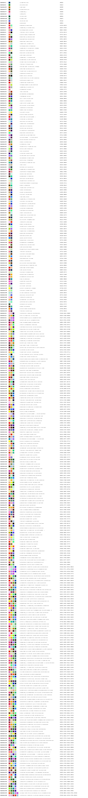

# APDOCC

The book ['A Dictionary of Color Combinations' by Sanzo Wada](https://www.amazon.com/Dictionary-Color-Combinations-Various/dp/4861522471) contains a collection of beautifully crafted color combinations.
This repository creates a digital version of the content and is basically a less polished version of the repository ['sanzo-wada' by dblodorn](https://github.com/dblodorn/sanzo-wada).

## Installation

```bash
uv add apdocc
# or: pip install apdocc
# or: poetry add apdocc
```

## Usage

```python
from apdocc import Colors, Combinations

print(Combinations[12].hexes())
# ['#d89e72', '#00ce91']
Combinations[12].show()
# shows the colored tiles in terminal
```

## All color combinations

<p align="center">
  
</p>

## Info

Find this repository on [Github](https://github.com/thomascamminady/apdocc) or check out the [documentation](https://thomascamminady.github.io/apdocc).

## Development

Set up the full project by running `make`.

## Documentation

Go to `Settings->Pages` and set `Source` (under `Build and deployment`) to `Github Actions`.

## Credits

This package was created with [`cookiecutter`](https://github.com/audreyr/cookiecutter) and [`thomascamminady/cookiecutter-pypackage`](https://github.com/thomascamminady/cookiecutter-pypackage), a fork of [`audreyr/cookiecutter-pypackage`](https://github.com/audreyr/cookiecutter-pypackage).

```

```
